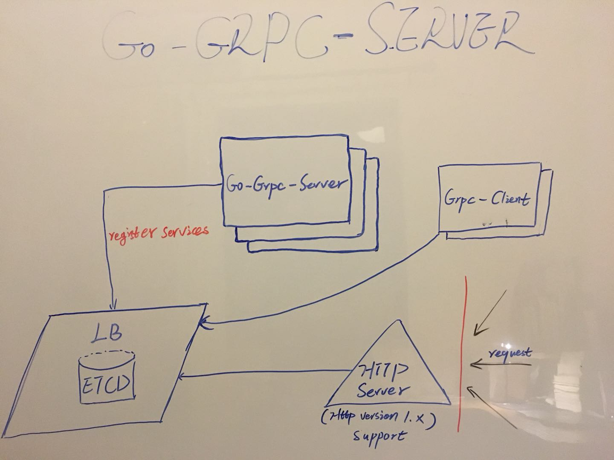

# GO-GRPC-SERVER

[](https://travis-ci.org/nightlegend/grpc-server-go) [](https://codecov.io/gh/nightlegend/grpc-server-go) [](https://goreportcard.com/report/github.com/nightlegend/grpc-server-go)

GO-GRPC is a grpc server demo written in [golang](https://golang.org/) and [grpc](https://grpc.io/). It features better performance, you can faster build your api server by this templete. If you want to try new way, you will love it.


<h2>Design</h2>



<h2>Running GO-GRPC-SERVER</h2>

* Init workdir
```sh
go get github.com/kardianos/govendor
cd $GOPATH/src/github.com/nightlegend/grpc-server-go
govendor init
govendor add +external
govendor install +local
```
> if can`t recognize govendor, please try $GOPATH/bin/govendor.

* Start [ETCD](https://coreos.com/etcd/docs/latest/) server

* Start GO-GRPC-SERVER

```sh
# HTTP server will listend address(eg:export HTTP_ADDR=":8080")
# default value is ':8080'
export HTTP_ADDR = ""
# Your ETCD server address(eg:export HTTP_ADDR="http://127.0.0.1:2379")
# default value is 'http://127.0.0.1:2379'
export ETCD_ADDR = ""


# -n mean you will up 3 grpc server for LB.
go run main.go -n 3
```

<small>Keep update to here for latest changed. Thanks for you love it.</small>
